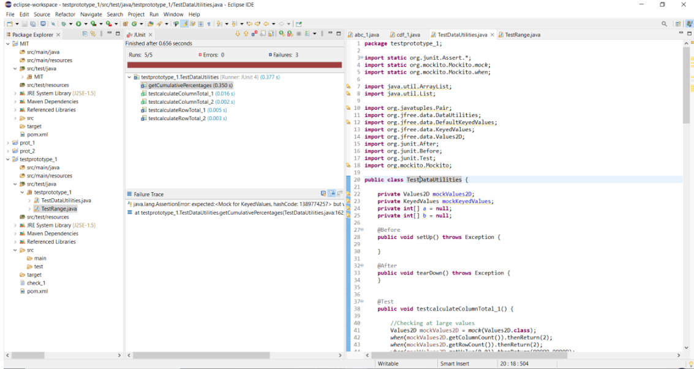
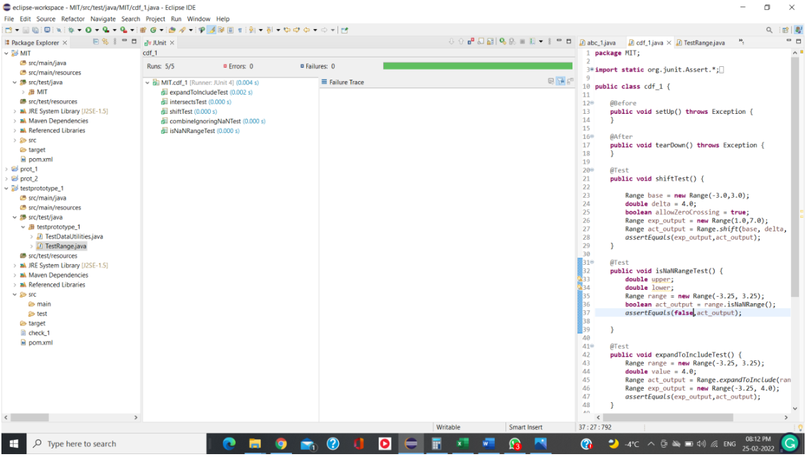
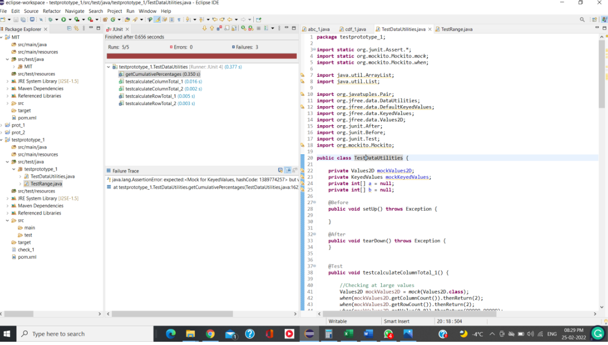
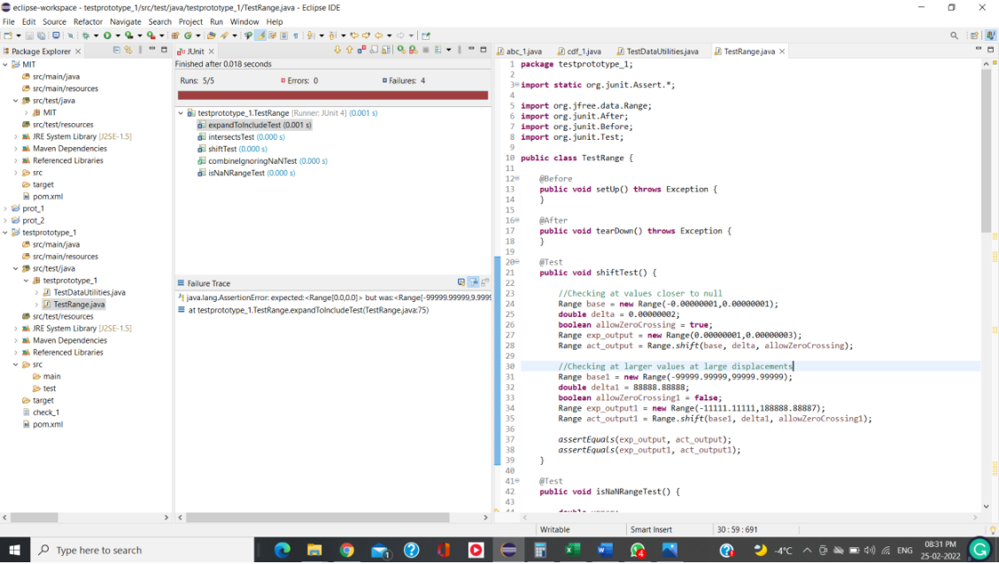

**SENG 637 - Dependability and Reliability of Software Systems**

**Lab. Report \#2 – Requirements-Based Test Generation**

| Group \#:  08     |     |
| --------------    | --- |
| Student Names:    |     |
|Mit Patel          |     |
|Dishantkumar Patel |     |
|Srujan Patel       |     |
|Jairath Chopra     |     |
# 1 Introduction
-Unit testing is a software development technique in which the smallest testable pieces of a program, referred to as units, are examined separately and independently for proper operation. Software developers and, on occasion, QA employees use this testing methodology during the development process. Unit testing's major goal is to separate written code to test and verify if it works as intended.
- Unit testing is a crucial phase in the development process because, if done correctly, it can assist uncover early defects in code that would otherwise be difficult to find in later stages of testing.
- JUnit is a Java programming language unit testing framework. A computer program's smallest functional module is called a unit. These are frequently presented in the form of a procedure. As a result, JUnit is frequently used to test the functionality of single methods.
- This concept has found a home in unit testing, where mock objects are produced to resemble real things in a controlled manner. Mock objects are a programmatically constructed mimicked version of the original object that is used to test the behavior of another object.
- Mockito is one of the most well-known mocking frameworks available on the Java market. Recently, unit testing with mocking frameworks has shown to be quite useful. Mockito has evolved into a distinct and substantial mocking framework over time.

# 2 Detailed description of unit test strategy

- In the assignment we used Mockito for creating the mock objects.
- At first, we did sort of exploratory testing. In the initial part, we tested the methods for the nominal values inputs present in the function domain. In this bugs were encountered in getCumulativePercentages(KeyedValues data) and calculateRowTotal(Values2D data, int row) methods of DataUtilities class while no bugs were encountered in Range Class. 

- In the next phase of testing we encountered we tested the SUT at the boundaries ie at values close to null and large values. In this phase, one more bug is found in the method calculateRowTotal(Values2D data, int row, int[] col) and four more bugs are encountered in four methods of Range class.

# 3 Test cases developed

# DataUtilities Class

package testprototype_1;
import static org.junit.Assert.*;
import static org.mockito.Mockito.mock;
import static org.mockito.Mockito.when;
import java.util.ArrayList;
import java.util.List;
import org.javatuples.Pair;
import org.jfree.data.DataUtilities;
import org.jfree.data.DefaultKeyedValues;
import org.jfree.data.KeyedValues;
import org.jfree.data.Values2D;
import org.junit.After;
import org.junit.Before;
import org.junit.Test;
import org.mockito.Mockito;
public class TestDataUtilities {
private Values2D mockValues2D;
private KeyedValues mockKeyedValues;
private int[] a = null;
private int[] b = null;
@Before
public void setUp() throws Exception {
}
@After
public void tearDown() throws Exception {
}
@Test
public void testcalculateColumnTotal_1() {
//Checking at large values
Values2D mockValues2D = mock(Values2D.class);
when(mockValues2D.getColumnCount()).thenReturn(2);
when(mockValues2D.getRowCount()).thenReturn(2);
when(mockValues2D.getValue(0,0)).thenReturn(99999.99999);
when(mockValues2D.getValue(1,0)).thenReturn(99999.99999);
// Checking at values closer to null
Values2D mockValues2D1 = mock(Values2D.class);
when(mockValues2D1.getColumnCount()).thenReturn(2);
when(mockValues2D1.getRowCount()).thenReturn(2);
when(mockValues2D1.getValue(0,0)).thenReturn(0.000000001);
when(mockValues2D1.getValue(1,0)).thenReturn(0.000000001);
double result_1 = DataUtilities.calculateColumnTotal(mockValues2D,
0);
double result_11 = DataUtilities.calculateColumnTotal(mockValues2D1,
0);
assertEquals(199999.99998, result_1, 0.000000001d);
assertEquals(0.000000002, result_11, 0.000000001d);
}
@Test
public void testcalculateRowTotal_1() {
//Checking at large values
Values2D mockValues2D = mock(Values2D.class);
when(mockValues2D.getColumnCount()).thenReturn(2);
when(mockValues2D.getRowCount()).thenReturn(2);
when(mockValues2D.getValue(0,1)).thenReturn(99999.99999);
when(mockValues2D.getValue(1,1)).thenReturn(99999.99999);
// Checking at values closer to null
Values2D mockValues2D1 = mock(Values2D.class);
when(mockValues2D1.getColumnCount()).thenReturn(2);
when(mockValues2D1.getRowCount()).thenReturn(2);
when(mockValues2D1.getValue(0,1)).thenReturn(0.000000001);
when(mockValues2D1.getValue(1,1)).thenReturn(0.000000001);
double result_2 = DataUtilities.calculateRowTotal(mockValues2D, 1);
double result_22 = DataUtilities.calculateRowTotal(mockValues2D1,
1);
assertEquals(199999.99998, result_2, 0.000000001d);
assertEquals(0.000000002, result_22, 0.000000001d);
}
@Test
public void testcalculateColumnTotal_2() {
Values2D mockValues2D = mock(Values2D.class);
when(mockValues2D.getColumnCount()).thenReturn(4);
when(mockValues2D.getRowCount()).thenReturn(4);
when(mockValues2D.getValue(0,0)).thenReturn(-99999.99999);
when(mockValues2D.getValue(1,0)).thenReturn(-0.000000001);
when(mockValues2D.getValue(2,0)).thenReturn(-99999.99999);
when(mockValues2D.getValue(3,0)).thenReturn(0.000000001);
int a[] = {0,2};
int b[] = {1,3};
//Checking at large negative values(magnitude wise)
double result_3 = DataUtilities.calculateColumnTotal(mockValues2D,
0, a);
//Checking at values close to null
double result_33 = DataUtilities.calculateColumnTotal(mockValues2D,
0, b);
assertEquals(-199999.99998, result_3, 0.000000001d);
assertEquals(0.000000000, result_33, 0.000000001d);
}
@Test
public void testcalculateRowTotal_2() {
Values2D mockValues2D = mock(Values2D.class);
when(mockValues2D.getColumnCount()).thenReturn(4);
when(mockValues2D.getRowCount()).thenReturn(4);
when(mockValues2D.getValue(0,0)).thenReturn(-99999.99999);
when(mockValues2D.getValue(0,1)).thenReturn(-0.000000001);
when(mockValues2D.getValue(0,2)).thenReturn(-99999.99999);
when(mockValues2D.getValue(0,3)).thenReturn(0.000000001);
int a[] = {0,2};
int b[] = {1,3};
//Checking at large negative values(magnitude wise)
double result_3 = DataUtilities.calculateColumnTotal(mockValues2D,
0, a);
//Checking at values close to null
double result_33 = DataUtilities.calculateColumnTotal(mockValues2D,
0, b);
assertEquals(-199999.99998, result_3, 0.000000001d);
assertEquals(0.000000000, result_33, 0.000000001d);
}
@Test
public void getCumulativePercentages() {
KeyedValues mockKeyedValues = mock(KeyedValues.class);
KeyedValues Exp_Result = mock(KeyedValues.class);
KeyedValues Act_Result = mock(KeyedValues.class);
double[] data =
{60.0,75.0,77.0,87.0,104.0,134.0,120.0,125.0,140.0,150.0};
double[] exp_result =
{0.055970149,0.125932836,0.197761194,0.278917910,0.375932836,0.500932836,0.6128731
34,0.729477612,0.860074627,1.000000000};
for(int i=0; i<data.length; i++) {
when(mockKeyedValues.getValue(mockKeyedValues.getKey(i))).thenReturn(data[i
]);
}
for(int i=0; i<data.length; i++) {
when(Exp_Result.getValue(Exp_Result.getKey(i))).thenReturn(exp_result[i]);
}
Act_Result = DataUtilities.getCumulativePercentages(mockKeyedValues);
assertEquals(Exp_Result, Act_Result);
}
}

# RangeTest

package testprototype_1;
import static org.junit.Assert.*;
import org.jfree.data.Range;
import org.junit.After;
import org.junit.Before;
import org.junit.Test;
public class TestRange {
@Before
public void setUp() throws Exception {
}
@After
public void tearDown() throws Exception {
}
@Test
public void shiftTest() {
//Checking at values closer to null
Range base = new Range(-0.00000001,0.00000001);
double delta = 0.00000002;
boolean allowZeroCrossing = true;
Range exp_output = new Range(0.00000001,0.00000003);
Range act_output = Range.shift(base, delta, allowZeroCrossing);
//Checking at larger values at large displacements
Range base1 = new Range(-99999.99999,99999.99999);
double delta1 = 88888.88888;
boolean allowZeroCrossing1 = false;
Range exp_output1 = new Range(-11111.11111,188888.88887);
Range act_output1 = Range.shift(base1, delta1, allowZeroCrossing1);
assertEquals(exp_output, act_output);
assertEquals(exp_output1, act_output1);
}
@Test
public void isNaNRangeTest() {
double upper;
double lower;
Range range = new Range(-3.25, 3.25);
boolean act_output = range.isNaNRange();
double upper1;
double lower1;
Range range1 = new Range(Double.NaN, Double.NaN);
boolean act_output1 = range.isNaNRange();
assertEquals(false,act_output);
assertEquals(true,act_output1);
}
@Test
public void expandToIncludeTest() {
//Checking at large values
Range range = new Range(-99999.99999,99999.99999);
double value = 999999999.0;
Range act_output = Range.expandToInclude(range, value);
Range exp_output = new Range(-99999.99999,999999999.0);
//Checking at null values
Range range1 = new Range(0.0000000,0.0000000);
double value1 = 0.0000000;
Range act_output1 = Range.expandToInclude(range, value);
Range exp_output1 = new Range(0.0000000,0.0000000);
assertEquals(exp_output,act_output);
assertEquals(exp_output1,act_output1);
}
@Test
public void combineIgnoringNaNTest() {
Range range1 = new Range(-99999.99999, Double.NaN);
Range range2 = new Range(Double.NaN, 99999.99999);
Range exp_output = new Range(-99999.99999, 99999.99999);
Range act_output = Range.combineIgnoringNaN(range1, range2);
Range range11 = new Range(Double.NaN, 0.00000000);
Range range22 = new Range(-0.00000001, Double.NaN);
Range exp_output1 = new Range(-0.00000001, 0.00000000);
Range act_output1 = Range.combineIgnoringNaN(range11, range22);
assertEquals(exp_output,act_output);
assertEquals(exp_output1,act_output1);
}
@Test
public void intersectsTest() {
double b0 = -0.00000001;
double b1 = 0.00000001;
Range range = new Range(0.00000002,0.00000003);
Boolean act_output = range.intersects(b0, b1);
double b01 = -99999.99999;
double b11 = 99999.99999;
Range range1 = new Range(-99999.9901,99999.9901);
Boolean act_output1 = range.intersects(b0, b1);
assertEquals(false,act_output);
assertEquals(true,act_output);
}
}
# 4 How the team work/effort was divided and managed
We are four group members in this course. Firstly, we read whole assignment and discussed what should we do to complete this assignment and we all understood about different types of testing frameworks unit testing. Srujan has created repository in git hub and sent invitation link to others. We shared test cases among us. Every member did one test case from Range class and one from DataUtilities Class
# 5 Difficulties encountered, challenges overcome, and lessons learned

We didn’t encounter much trouble in doing testing. Through the lab we learned how to do testing in a structured manner and got to know how the whole process is executed by industry professionals.
# 6 Comments/feedback on the lab itself

The lab proved to be very informative exerciser in terms of an introductory exercise to writing unit tests using junit and using test frameworks like Mockito